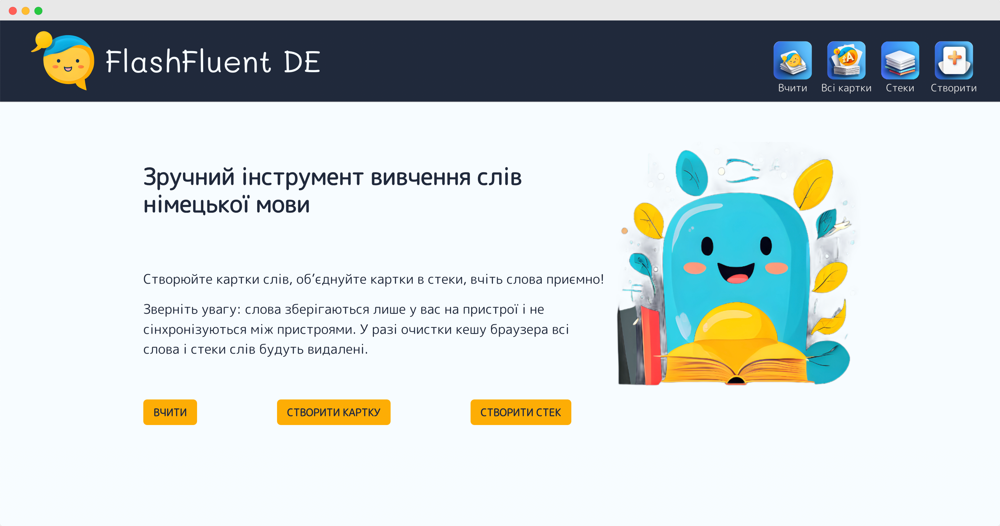
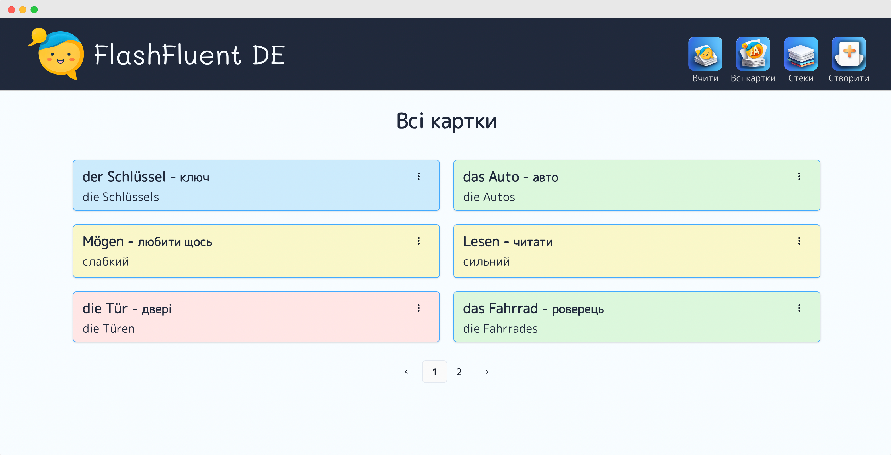
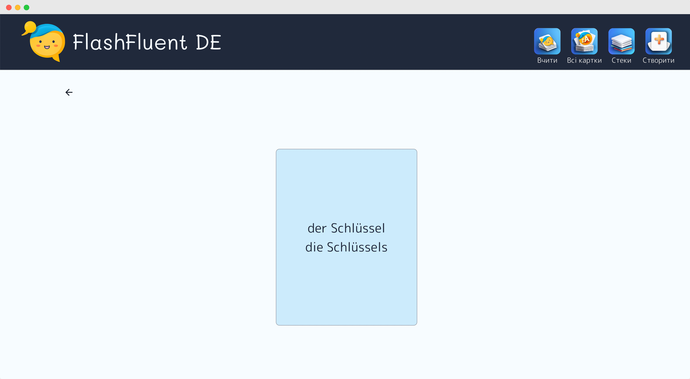

# FlashFluent DE

FlashFluent DE is a web application designed for learning German. Users can add words and learn them through interactive flashcards. For now the app is available only with Ukrainian interface.

## Features

-   Add new German words to your collection
-   Practice and learn words using flashcards
-   Track your learning progress

## Technologies Used

-   React + Vite
-   Redux persist
-   Chakra UI
-   PWA

## Deployed Application

You can try the live version of the app [here](https://maxteenspirit.github.io/flashcards-maker/).

## Screenshots

## Contributing

Contributions are welcome! Please open an issue or submit a pull request for any features or improvements.

## License

This project is licensed under the MIT License - see the [LICENSE](LICENSE) file for details.
